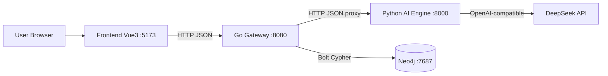
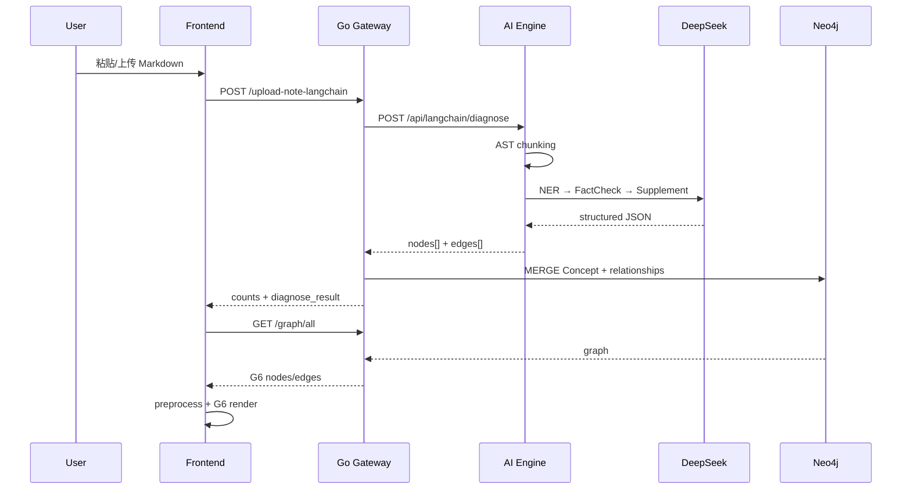

# ARCHITECTURE.md

> 面向开发者与 AI Coding Agent 的系统架构说明书。  
> 依据仓库源码整理；与申请书 / 里程碑冲突时以代码为准。

---

## 1. Architecture Overview



**核心数据流（主路径）**



---

## 2. Runtime Components

### Frontend
- **职责**：Knowledge Graph Workspace UI；发起上传 / 拉图 / 对话 / 路径；G6 渲染与交互。
- **进程**：`npm run dev`（Vite，默认打开浏览器）。
- **不负责**：直接访问 Neo4j；直接调用 DeepSeek。

### Go Gateway
- **职责**：HTTP API、CORS、用户 ID 解析、调用 Python、图谱归一化、Neo4j 读写、文件与会话管理、路径 DFS。
- **进程**：`go run .`，默认 `:8080`。
- **健康检查**：`GET /health`。

### Python AI Engine
- **职责**：Markdown AST 切分、LangChain 诊断、ReAct Chat、学习路径文案、旧版 parse/explain。
- **进程**：`uvicorn main:app --reload --port 8000`。
- **健康检查**：`GET /health`、`GET /api/langchain/health`、`GET /health/deepseek`。

### Neo4j
- **职责**：概念图、文件元数据、对话消息持久化。
- **进程**：`docker compose up -d`（仅此服务在 compose 中）。
- **端口**：7474（HTTP）、7687（Bolt）。

### External LLM
- **职责**：实体关系抽取、事实校验、补全、对话推理、概念讲解、学习路径文案。
- **Provider**：DeepSeek（`DEEPSEEK_BASE_URL` + `DEEPSEEK_API_KEY` + `DEEPSEEK_MODEL`）。

---

## 3. Frontend Architecture

| 主题 | 事实 |
|------|------|
| 路由 | **无 Vue Router**；`App.vue` → `view/main.vue` |
| 状态 | **无 Pinia**；状态集中在 `main.vue` 的 `ref` |
| API | `src/api/graph.ts`（fetch） |
| 图谱 | `src/graph/g6-config.ts` + `main.vue` 内 Graph 实例 |
| Markdown 渲染 | `marked`（AI 回复） |

### 三栏布局（`main.vue`）

| 栏 | 组件 | 职责 |
|----|------|------|
| 左 | `FileSidebar.vue` | 文件/组列表、上传、登录 user_id、CRUD |
| 中 | G6 canvas | 图谱、工具栏、节点详情浮层 |
| 右 | `ImportPanel` → `LearningNavPanel` → `AiChatPanel` | 导入、逆向导航、AI 对话 |

### Knowledge Graph Visualization
- AntV G6 v5：`drag-canvas` / `zoom-canvas` / `drag-element`
- 预处理：同义合并、置信度过滤、去自环、去重、去孤立点（`preprocessGraphData`）
- 样式：`correct` / `error` / `supplement` 三态
- 布局：force / dagre / auto
- LightRAG 模式：先核心 N 节点，点击展开 `/graph/neighbors`

### Learning Report / Path
- **无独立页面**；诊断摘要与学习路径 `guidance` 推入 `AiChatPanel` 消息列表。

### 关键路径
- `frontend/src/view/main.vue`
- `frontend/src/api/graph.ts`
- `frontend/src/graph/g6-config.ts`
- `frontend/src/components/*.vue`

---

## 4. Go Backend Architecture

```text
Request
  → router/router.go          # 路由 + CORS + /health
  → controller/graph_controller.go
  → service/graph_service.go  # Python HTTP + 业务编排
  → repository/graph_repository.go  # Cypher
  → Neo4j
     或
  → Python AI Engine (proxy)
```

| 层 | 路径 | 作用 |
|----|------|------|
| Router | `internal/router/router.go` | 注册端点、CORS |
| Controller | `internal/controller/graph_controller.go` | 绑定 JSON、解析 user_id、写 HTTP 状态 |
| Service | `internal/service/graph_service.go` | 调 Python、normalize、委托 repo |
| Repository | `internal/repository/graph_repository.go` | 全部 Cypher |
| Model | `internal/model/graph.go` | DTO / G6 / Chat / Path |
| Config | `internal/config/config.go` | 环境变量（**不**读 `.env` 文件） |

### 用户 ID 解析顺序
`body.user_id` → header `X-User-ID` → query `user_id` → `DEFAULT_USER_ID`

### 启动序列（`main.go`）
1. `config.Load()`  
2. Neo4j driver + `VerifyConnectivity`  
3. Repository → Service → Controller → Router  
4. `Run(":" + PORT)`

---

## 5. Python AI Engine Architecture

```text
FastAPI (main.py)
  ├─ app/api/parse.py              # legacy /api/parse, /api/explain
  └─ app/langchain_agent/router.py # /api/langchain/*
        ├─ DiagnosisChain
        │    NERAgent → FactCheckAgent → SupplementAgent → aggregate
        ├─ ReactChatAgent (+ tools)
        └─ learning-path (Prompt | LLM, 非 Agent 类)
```

### Agents

| 名称 | 文件 | 输入 | 输出 | 调用顺序 |
|------|------|------|------|----------|
| NERAgent | `agents/ner_agent.py` | chunks | `NEROutput` | Stage 1（必须成功） |
| FactCheckAgent | `agents/fact_check_agent.py` | NER + md | `FactCheckOutput` | Stage 2（可降级） |
| SupplementAgent | `agents/supplement_agent.py` | NER + md | `SupplementOutput` | Stage 3（可跳过） |
| ReactChatAgent | `agents/react_chat_agent.py` | message + md + graph | reply + edited_md | 仅 `/chat` |

- **并行**：诊断链为**串行**；无多 Agent 并行。  
- **Tools**：仅 ReactChat 使用（读/改 markdown、搜图谱）。  
- **Prompt**：`prompts/templates.py` + ReactChat 内联 `SYSTEM_PROMPT` + `deepseek_service` 内联。  
- **LLM**：`langchain_openai.ChatOpenAI` → DeepSeek；legacy 用 `openai.OpenAI`。  
- **Structured Output**：Pydantic + `PydanticOutputParser`（含 JSON salvage）。

### 版本
`main.py` 声明 `version="0.3.0"`。

---

## 6. Knowledge Graph Pipeline

```text
Markdown 文本
  → split_markdown_to_chunks (markdown-it-py AST / 空行兜底)
  → NERAgent.extract (entities + relations)
  → FactCheckAgent.verify (status/reason/definition)
  → SupplementAgent.detect_gaps (supplement nodes + SUPPLEMENTS edges)
  → DiagnosisChain._aggregate
  → Go normalizeLangChainData
  → Neo4j MERGE (:Concept) + dynamic relationships
  → GET /graph/all
  → frontend preprocessGraphData + buildStyledGraph
  → AntV G6 setData + layout
```

**并行旧路径**：`POST /api/parse` 直接抽 `GraphEdge[]`（无独立 NER 阶段）；前端主路径**不使用**。

**自动建文件**：LangChain 上传若无 `file_id`，Go 用 markdown 前 30 字创建 `:File`。

---

## 7. AI Chat Pipeline

```text
用户消息 (+ 可选 image_base64)
  → Frontend 附带 markdown, graph_nodes, graph_edges, conversation_id
  → POST /graph/chat (Go 透传)
  → POST /api/langchain/chat
  → ReactChatAgent.set_document → 内存 _doc_store
  → LangGraph ReAct invoke (tools 可搜图谱 / 改笔记)
  → reply (+ edited_markdown)
  → Frontend 展示；saveMessage → Neo4j（失败静默）
```

**图谱上下文如何进 Prompt**  
- **主要**：工具 `search_knowledge_graph` 查 `_doc_store`  
- **不是**：把全图塞进 system prompt（`get_chat_prompt` / `format_graph_context` 未用于 chat）  
- **对话历史**：Neo4j 可存，但**每次 LLM invoke 仅当前 HumanMessage**（无多轮注入）

---

## 8. Learning Path Pipeline

```text
LearningNavPanel: 目标概念 + maxDepth
  → GET /graph/path?concept=&maxDepth=
  → Neo4j: 仅沿 PREREQUISITE_OF 逆向多跳
  → PathResponse{ paths, dependency_tree, all_related }
  → Frontend focus + dagre 高亮
  → 若 dependency_tree 非空:
       POST /graph/learning-path
         { target_concept, dependency_tree_json, graph_nodes_json }
  → Python: format_dependency_tree + format_graph_context(nodes only)
  → LLM → guidance 文本 → 推入聊天面板
```

**现状**：初始可用实现。质量取决于关系是否被标成 `PREREQUISITE_OF`。无学习者画像 / 掌握度。

---

## 9. Neo4j Architecture

### Labels
`Concept`, `File`, `FileGroup`, `Conversation`, `Message`

### Relationships
- Concept→Concept：动态类型（默认回退 `RELATED_TO`）  
- `Conversation -[:CONTAINS]-> Message`

### 主要查询（见 `graph_repository.go`）
| 操作 | 逻辑 |
|------|------|
| Upsert 实体 | `MERGE (n:Concept {user_id, name}) SET ...` |
| Upsert 关系 | MERGE 两端 + `MERGE (s)-[r:TYPE {user_id}]->(t)` |
| 全图 / 按文件 / 按组 | MATCH Concept + 关系，可选 file 过滤 |
| 路径 | `PREREQUISITE_OF*1..N` 逆向 |
| 邻居 | 可变深度 pattern，深度钳制 1–3 |
| 删文件 | `DETACH DELETE` File 节点（不删 Concept） |

### 创建 / 更新 / 删除
- Concept：**仅 Upsert**，无独立 DELETE API  
- File/Group/Conversation：完整 CRUD（见 API Map）

---

## 10. API Map

### Go Gateway（Caller ≈ Frontend，除非注明）

| Method | Endpoint | Service | Purpose | Caller |
|--------|----------|---------|---------|--------|
| GET | `/health` | router | 健康检查 | 运维/人工 |
| POST | `/upload-note` | UploadNote | 旧解析入库 | API 已定义，前端未调 |
| POST | `/upload-note-langchain` | UploadNoteLangChain | 诊断入库 | Frontend |
| GET | `/graph/all` | GetGraphAll | 拉图谱 | Frontend |
| GET | `/graph/path` | GetGraphPath | 逆向依赖 | Frontend |
| GET | `/graph/neighbors` | GetNodeNeighbors | 邻居子图 | Frontend |
| POST | `/graph/explain` | ExplainConcept | 概念讲解 | Frontend |
| POST | `/graph/chat` | ChatWithContext | AI 对话代理 | Frontend |
| POST | `/graph/learning-path` | LearningPath | 路径文案代理 | Frontend |
| GET | `/files` | ListUserFiles | 文件列表 | Frontend |
| POST | `/files/create` | CreateFile | 建文件 | 前端未直接调；上传可间接触发 |
| POST | `/files/group/create` | CreateFileGroup | 建组 | Frontend |
| DELETE | `/files/delete` | DeleteFile | 删文件 | Frontend |
| PUT | `/files/rename` | RenameFile | 重命名 | Frontend |
| PUT | `/files/group/rename` | RenameFileGroup | 重命名组 | Frontend |
| POST | `/files/add-to-group` | AddFileToGroup | 入组 | Frontend |
| PUT | `/files/pin` | TogglePinFile | 置顶 | Frontend |
| PUT | `/files/group/pin` | TogglePinFileGroup | 组置顶 | Frontend |
| DELETE | `/files/group/delete` | DeleteFileGroup | 删组 | Frontend |
| GET | `/conversation` | GetConversation | 取/建会话 | Frontend |
| POST | `/conversation/message` | SaveMessage | 存消息 | Frontend |
| DELETE | `/conversation` | DeleteConversation | 清空会话 | Frontend |

### FastAPI（Caller ≈ Go）

| Method | Endpoint | Purpose | Caller |
|--------|----------|---------|--------|
| GET | `/health` | 服务健康 | 运维 |
| GET | `/health/deepseek` | Key 是否配置 | 运维 |
| POST | `/api/parse` | 旧关系抽取 | Go UploadNote |
| POST | `/api/explain` | 概念讲解 | Go Explain |
| POST | `/api/langchain/diagnose` | 三 Agent 诊断 | Go LangChain 上传 |
| POST | `/api/langchain/chat` | ReAct 对话 | Go Chat |
| POST | `/api/langchain/learning-path` | 学习路径文案 | Go LearningPath |
| GET | `/api/langchain/health` | LangChain 模块状态 | 运维 |

---

## 11. Important Data Structures

### TypeScript（`frontend/src/api/graph.ts`）
`UploadNotePayload`, `GraphNode`, `GraphEdge`, `GraphResponse`, `DependencyNode`, `PathResponse`, `ExplainPayload/Response`, `UserFile`, `FileGroup`, `ChatRequest/Response`, `LearningPathRequest/Response`, `Conversation`, `ConversationMessage`

### Go（`internal/model/graph.go`）
`UploadNoteRequest`, `ParseRelation/Response`, `LangChainDiagnose*`, `Entity`, `Relation`, `GraphData`, `G6Node/Edge/GraphResponse`, `PathResponse`, `ChatRequest/Response`, `LearningPathRequest/Response`, `Conversation*`

### Python
- Legacy：`app/schemas/graph.py` → `GraphEdge`, `ParseRequest/Response`  
- Agents：`app/langchain_agent/schemas/agent_output.py` → `NEROutput`, `FactCheckOutput`, `SupplementOutput`, `DiagnosisNode/Edge/Output`  
- Router：`DiagnoseRequest/Response`, `ChatRequest/Response`, `LearningPathRequest/Response`

### 状态枚举（跨服务应对齐）
`correct` | `error` | `supplement`

### 关系枚举（Python）
`PREREQUISITE_OF` | `BELONGS_TO` | `RELATED_TO` | `SUPPLEMENTS` | `CORRECTS`（CORRECTS 通常不落边）

---

## 12. Cross-Service Contracts

### Frontend ↔ Go
- Base URL：`VITE_API_BASE_URL` 或 `http://localhost:8080`  
- JSON camel/snake：Go 使用 `json` tag 的 snake_case（如 `user_id`, `file_id`, `dependency_tree`）  
- 图谱：`{ nodes: G6Node[], edges: G6Edge[] }`  
- Chat：前端传 `graph_nodes`/`graph_edges` **字符串化 JSON**

### Go ↔ Python
| Go 调用 | Body | 期望响应关键字段 |
|---------|------|------------------|
| `/api/parse` | `{markdown}` | `chunks`, `relations`, `retries_used` |
| `/api/langchain/diagnose` | `{markdown}` | `success`, `nodes`, `edges`, `summary`, … |
| `/api/explain` | `{concept, markdown}` | `concept`, `explanation` |
| `/api/langchain/chat` | ChatRequest 透传 | `reply`, `conversation_id`, `edited_markdown` |
| `/api/langchain/learning-path` | LearningPathRequest 透传 | `guidance` |

超时：`PYTHON_PARSE_TIMEOUT_SECONDS`（默认 120s）应用于整个 HTTP Client。

### Go ↔ Neo4j
- Auth：Basic（URI/USER/PASSWORD）  
- Concept 幂等键：`(user_id, name)`  
- 关系类型经 `sanitizeRelType` 消毒  

**易崩点**：任一端改字段名而未同步另外两端；邻居边 ID 语义与路径边不一致。

---

## 13. Configuration

### 端口（默认）
| 服务 | 端口 |
|------|------|
| Frontend (Vite) | 5173（Vite 默认） |
| Go | 8080 |
| Python | 8000 |
| Neo4j Browser | 7474 |
| Neo4j Bolt | 7687 |

### 环境变量（勿提交真实 Secret）

**Python**（`.env` 由 dotenv 加载；`.env.example` 仅作模板）  
`DEEPSEEK_BASE_URL`, `DEEPSEEK_API_KEY`, `DEEPSEEK_MODEL`

**Go**（进程环境；不自动读 `.env`）  
`PORT`, `NEO4J_URI`, `NEO4J_USERNAME`, `NEO4J_PASSWORD`, `PYTHON_SERVICE_URL`, `PYTHON_PARSE_TIMEOUT_SECONDS`, `DEFAULT_USER_ID`

**Frontend**  
`VITE_API_BASE_URL`（可选）

**Docker Neo4j**  
`NEO4J_AUTH=neo4j/password`（compose 内）

**CORS**：Go `AllowOrigins: *`，允许 `X-User-ID`。

---

## 14. Startup Sequence

推荐本地顺序：

1. **Neo4j** — `docker compose up -d`  
   - 确认：浏览器 `http://localhost:7474` 或 Bolt 连通  
2. **AI Engine** — `cd ai-engine-python` → venv → `uvicorn main:app --reload --port 8000`  
   - 确认：`GET http://localhost:8000/health`  
3. **Go Backend** — 注入环境变量后 `cd backend-go && go run .`  
   - 确认：`GET http://localhost:8080/health`（需 Neo4j 已通，否则进程 Fatal）  
4. **Frontend** — `cd frontend && npm install && npm run dev`  

清空图数据（README）：

```bash
docker exec -it agent-neo4j cypher-shell -u neo4j -p password "MATCH (n) DETACH DELETE n"
```

---

## 15. Architecture Risks

（仅列有代码证据者）

1. **三端 Contract 重复定义** — TS / Go / Pydantic 手写同步，易漂移。  
2. **Schema 不统一** — 计划 Course/CORRECTS/PART_OF_GROUP vs 实际；邻居边 ID vs 概念名。  
3. **双解析路径** — `/api/parse` 与 diagnose 并存，增加维护面。  
4. **Chat 状态机内存化** — `_doc_store` 进程内 dict，多 worker / 重启丢失。  
5. **路径质量耦合关系类型** — DFS 写死 `PREREQUISITE_OF`。  
6. **Prompt 与业务耦合** — 聚合规则、状态枚举散落在 Agent + Chain + 前端样式。  
7. **鉴权缺失** — user_id 可伪造；CORS 全开。  
8. **无自动化测试** — 回归依赖人工联调。  
9. **Go 不加载 `.env`** — 与 Python 习惯不一致，易造成「配了但不生效」。  

---

## Where To Modify What

| 想改什么 | 从这些文件开始 |
|----------|----------------|
| 图谱渲染 / 三态颜色 / 布局 | `frontend/src/graph/g6-config.ts`, `frontend/src/view/main.vue` |
| 三栏布局 / 面板 UI | `main.vue`, `components/*.vue`, `.cursor/rules/01-ui-components.md` |
| 前端 API 调用 | `frontend/src/api/graph.ts` |
| 新增 / 修改 Go API | `router.go` → `graph_controller.go` → `graph_service.go` →（如需）`graph_repository.go` + `model/graph.go` |
| Neo4j 读写 / 关系类型 | `backend-go/internal/repository/graph_repository.go` |
| Agent Prompt | `ai-engine-python/app/langchain_agent/prompts/templates.py`；Chat 另看 `react_chat_agent.py` |
| 诊断流水线顺序 / 聚合 | `chains/diagnosis_chain.py` |
| 单个 Agent 逻辑 | `agents/ner_agent.py` / `fact_check_agent.py` / `supplement_agent.py` |
| Chat 工具 | `tools/agent_tools.py`, `react_chat_agent.py` |
| Markdown 切分 | `app/services/markdown_parser.py` |
| 学习路径文案 | Python `router.py` learning-path + `get_learning_path_prompt`；依赖树在 Go `GetGraphPath` |
| LLM 配置 | `ai-engine-python/app/core/config.py`, `.env` |
| 产品原则 | `.cursor/rules/00-product-design.md`（改完同步文档） |

### 增加 API 的标准层路径
1. 定 Contract（TS + Go model + 如需 Python schema）  
2. Python 路由（若 AI 相关）  
3. Go repository（若落库）→ service → controller → router  
4. Frontend `graph.ts` + UI 调用  

### 增加 Neo4j Relationship
1. Agent `RelationType` + Prompt 示例  
2. DiagnosisChain 聚合  
3. Go `sanitizeRelType` / 路径过滤是否要包含新类型  
4. 前端边标签 / dagre 层级启发式  

---

## Document Meta

| 字段 | 值 |
|------|----|
| **Last Updated** | 2026-09-12 |
| **Branch** | `main` |
| **Commit** | `b142bd3ae1c2d82fe033fca047549a5fc05f8b13` |
| **Companion Docs** | `PROJECT_CONTEXT.md`, `PROJECT_STATUS.md`, `AGENTS.md` |
